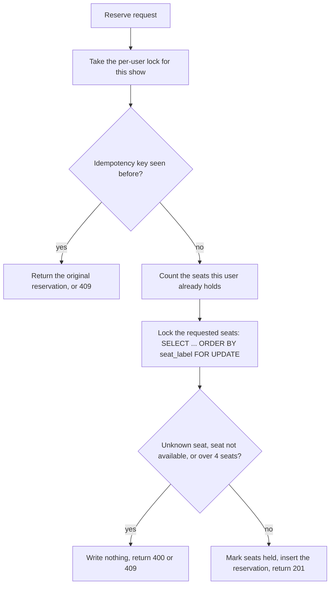

# Write-up

How the service gives every seat to exactly one buyer under a stampede, and what I measured to believe it.
Usage is in [README.md](README.md).

## 1. The atomic decision

**Mechanism: row locks on the seat rows, taken in one sorted statement, with the decision made before any write.**

Every step runs in one transaction. A declined request writes nothing, so there is nothing to undo.

**Why it is race-free.** The check ("is this seat available?") and the change ("it is now held") happen while the
request holds the row lock. If Alice and Bob both want A12, one of them gets the lock. The other waits, and when the
lock is released it reads the row again under `READ COMMITTED` and sees `held`, so it is told `409`. There is no
moment in which two requests can both see `available`.

**Why it cannot deadlock.** A deadlock needs two requests holding one lock each and waiting for the other's. So
every code path takes its locks in the same order:

- Seats are always locked with one explicit `ORDER BY seat_label` statement, never one at a time. A request for
  `A13, A12` and one for `A12, A13` both lock `A12` first. A test stores seats in the opposite physical order and fails
  if the `ORDER BY` is removed.
- Reserve takes the per-user lock, then seats. Cancel and expiry take the reservation row, then its seats in the same
  sorted order. Reserve never waits for another reservation's row, because the one it inserts is new.

**Why not the alternatives.**

| Option | Why not |
|---|---|
| Read the seat, then write | Two buyers both read `available` and both win. This is the double-sell bug. |
| Optimistic version check with retries | Hundreds of buyers on one hot seat cause retry storms and failures. |
| Serializable isolation | Hot seats cause mass serialization failures that need retries. |
| A Redis lock in front of the database | A second system that can disagree with the database. |
| **Row lock + decide before writing (chosen)** | Correct by construction, no retries, one datastore. |

## 2. The per-user limit

At most 4 seats per user per show, even when one user sends many requests at once. Before counting, each request
takes a Postgres advisory lock keyed on show and user, so one user's requests for a show run one after another.
Without it, two parallel requests could each count "0 seats held", both pass, and the user would end up with more than
4. A test sends ten requests from one user at the same moment and checks that exactly 4 seats end up held.

## 3. Idempotency

Every reserve carries an `idempotency_key`. The database holds a unique constraint on `(show, user, key)`, and the
lookup happens under the per-user lock, so two identical requests can never both pass it.

| Request | Result |
|---|---|
| Same key, same seats | The original reservation is returned; nothing new is booked. |
| Same key, different seats | `409 IDEMPOTENCY_KEY_REUSED` |
| Same key, first attempt was declined | The retry tries again, because a declined attempt leaves nothing behind. |
| Same key, reservation since cancelled or expired | `409 RESERVATION_NOT_ACTIVE`; use a new key. A `201` for seats the user no longer holds would be a lie. |

This is also what makes retries safe during an outage (section 5): if a connection drops after the commit, the client
cannot know whether it booked, and resending the same key is always safe.

## 4. Holds and expiry

A reservation is a hold. It expires 5 minutes after it is made unless cancelled first. The only states are
`available` and `held`; there is no confirm or payment step, so no seat is ever `confirmed`.

A background job runs every second. It finds holds past their expiry (a partial index keeps this cheap), and expires
each one in **its own transaction**: lock the reservation row, check it is still held, free its seats in sorted order,
mark it expired. Because of the re-check under the lock, it is safe to run on several instances, and a cancel that
lands at the same moment simply wins or loses cleanly. One hold failing is logged and skipped; it cannot stop the rest.

I first expired holds in batches. Locking several reservations' seats in one transaction took them in an order that
could differ from reserve's, and a test reproduced the resulting deadlock. Expiring one hold at a time removed the
problem and the code that caused it.

## 5. Consistency versus availability

**The service chooses consistency.** Postgres is the only source of truth, and nothing about a seat is ever guessed
from a cache. If the database is unreachable (down, partitioned from the app, or no connection can be had), requests
return `503` with `Retry-After: 1`, and both health checks report `DOWN`. It never accepts a booking it cannot record,
so it can never double-sell, at the price of being unavailable until the database is back.

Timeouts keep this honest: a request waits up to 30 seconds for a pooled connection (during a burst it should queue,
not fail), and a 10-second lock timeout turns a stuck transaction into a `503` instead of an endless wait. Health
checks use their own two-connection pool, so a burst that fills the main pool cannot make the service look dead and
get it restarted.

A single database is a single point of failure. High availability (a replica and failover) is the database
platform's job and is out of scope here.

## 6. Observability, and what pages you at 2am

Logs are JSON, one line per event, each with a `requestId` that is also returned in the `X-Request-Id` header, so a
customer's complaint maps to one trace of log lines. Metrics are at `/actuator/prometheus`:

- `http_server_requests_seconds_*`: traffic, latency and errors by status.
- `reservations_total{outcome,reason}`: created and declined, by reason. (A series appears on its first event.)
- `seats_available`: seats free across all shows.
- `hikaricp_connections_*`: pool saturation.

| Page on | Why | Signal |
|---|---|---|
| Any sustained `5xx` or `503` | The rule is zero server errors; these are real failures | `http_server_requests_seconds_count{status=~"5.."}` |
| Readiness failing | The service cannot reach its database | the readiness probe, or the Prometheus `up` target |
| Pool saturated | Requests are queuing for a connection and will time out next | `hikaricp_connections_pending` stays above 0 |
| Traffic but no sales | Buyers are arriving, seats are free, nothing is being created | `rate(reservations_total{outcome="created"}[5m]) == 0` while `seats_available > 0` and request traffic is high |

I would **not** page on `409` declines. In a stampede they are the normal outcome. Seat totals cannot disagree by
design: the show state is computed from one snapshot of the seats, and a database constraint stops a seat from being
half-owned. The burst script checks the invariant end to end.

## 7. Evidence

148 automated tests run against a real PostgreSQL. The concurrency ones include 500 users on one seat (exactly one
`201`), 1,000 users on 100 seats (exactly 100 sold), 200 requests for the same two seats in opposite order (no
deadlock), one user sending ten requests at once (exactly 4 held), the same key sent 50 times at once (one
reservation), and a test that really stops the database.

The burst (`scripts/burst.sh`) sends 20,000 requests from 2,000 concurrent users at a fresh 100-seat show:

| Run | 201 | 409 | 5xx | p95 | Slowest request | Result |
|---|---|---|---|---|---|---|
| Local, run 1 | 93 | 19,907 | 0 | 3.6 s | 5.1 s | PASS |
| Local, run 2 | 95 | 19,905 | 0 | 1.7 s | 2.4 s | PASS |
| Docker compose | 97 | 19,903 | 0 | 3.9 s | 5.7 s | PASS |

Every run answered all 20,000 requests and ended with all 100 seats held, no seat sold twice, and no user over 4
seats. In the compose run Prometheus's own counters (97 created, 19,903 declined) matched the report exactly. A `201`
can cover two seats, so the `201` count is a little under 100.

Three things I checked so the numbers can be trusted:

- **The script catches real bugs.** With the seat-availability check disabled (a 500-user run), it reported `FAIL`:
  the `201`s claimed 5,729 seats while only 100 were held, and 3,272 requests pushed a user over the limit.
- **Tuning was measured, not assumed.** I tried virtual threads and a larger connection pool. Neither helped; virtual
  threads made the slowest request worse (8 to 18 seconds against 2 to 5), so the service uses the defaults.
- **Memory.** On Render's 512 MB free instance the first JVM settings got the process killed by the out-of-memory
  killer under the full burst. A smaller heap, the serial collector and small thread stacks fixed it.

These runs used one machine for the load generator, the service and the database, and 2,000 concurrent users rather
than 20,000 simultaneous connections. Treat the latencies as relative, not as a capacity claim.
